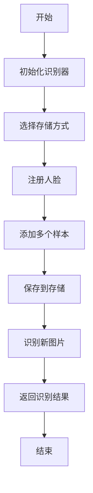

# 人脸识别库完整使用指南

## 目录
1. [支持的图片格式](#支持的图片格式)
2. [人脸向量存储](#人脸向量存储)
3. [完整示例](#完整示例)
4. [API 参考](#api-参考)

## 支持的图片格式

该库支持以下图片格式：

- **JPEG** (.jpg, .jpeg)
- **PNG** (.png)
- **BMP** (.bmp)
- **TIFF** (.tif, .tiff)
- **WebP** (.webp)
- **GIF** (.gif)

### 加载图片的三种方式

```go
// 方式 1: 从文件路径加载
img, err := face.LoadImage("path/to/image.jpg")
if err != nil {
    log.Fatal(err)
}
defer img.Close()

// 方式 2: 从字节数据加载
data, _ := ioutil.ReadFile("image.jpg")
img, err := face.LoadImageFromBytes(data)
if err != nil {
    log.Fatal(err)
}
defer img.Close()

// 方式 3: 从 Go 标准 image.Image 转换
var stdImg image.Image // 从某处获取
img, err := face.LoadImageFromStdImage(stdImg)
if err != nil {
    log.Fatal(err)
}
defer img.Close()
```

### 检查图片格式

```go
if face.IsSupportedImageFormat("photo.jpg") {
    fmt.Println("支持的格式")
}

// 获取图片信息
width, height, channels, err := face.GetImageInfo("photo.jpg")
fmt.Printf("尺寸: %dx%d, 通道: %d\n", width, height, channels)
```

## 人脸向量存储

库提供了三种存储方式：

### 1. 内存存储 (默认)

快速但不持久化，程序重启后数据丢失。

```go
storage := face.NewMemoryStorage()

recognizer, err := face.NewFaceRecognizer(
    config,
    face.WithStorage(storage),
)
```

### 2. 文件系统存储 (推荐)

每个人的数据存储为单独的 JSON 文件，适合中小规模应用。

```go
storage, err := face.NewFileStorage("./face_database")
if err != nil {
    log.Fatal(err)
}
defer storage.Close()

recognizer, err := face.NewFaceRecognizer(
    config,
    face.WithStorage(storage),
)
```

存储结构：
```
face_database/
├── 001.json  (Alice 的数据)
├── 002.json  (Bob 的数据)
└── 003.json  (Charlie 的数据)
```

### 3. JSON 文件存储

所有数据存储在单个 JSON 文件中，适合小规模应用。

```go
storage, err := face.NewJSONStorage("./faces.json")
if err != nil {
    log.Fatal(err)
}
defer storage.Close()

recognizer, err := face.NewFaceRecognizer(
    config,
    face.WithStorage(storage),
)
```

### 自定义存储实现

实现 `FaceStorage` 接口以支持数据库（如 PostgreSQL、MySQL、MongoDB）：

```go
type FaceStorage interface {
    SavePerson(person *Person) error
    LoadPerson(id string) (*Person, error)
    LoadAllPersons() ([]*Person, error)
    DeletePerson(id string) error
    PersonExists(id string) (bool, error)
    Close() error
}
```

#### 示例：PostgreSQL 存储

```go
type PostgreSQLStorage struct {
    db *sql.DB
}

func NewPostgreSQLStorage(connStr string) (*PostgreSQLStorage, error) {
    db, err := sql.Open("postgres", connStr)
    if err != nil {
        return nil, err
    }

    return &PostgreSQLStorage{db: db}, nil
}

func (s *PostgreSQLStorage) SavePerson(person *face.Person) error {
    data, err := json.Marshal(person)
    if err != nil {
        return err
    }

    _, err = s.db.Exec(
        "INSERT INTO persons (id, name, features) VALUES ($1, $2, $3) "+
        "ON CONFLICT (id) DO UPDATE SET name = $2, features = $3",
        person.ID, person.Name, data,
    )
    return err
}

func (s *PostgreSQLStorage) LoadPerson(id string) (*face.Person, error) {
    var data []byte
    err := s.db.QueryRow(
        "SELECT features FROM persons WHERE id = $1", id,
    ).Scan(&data)

    if err != nil {
        return nil, err
    }

    var person face.Person
    err = json.Unmarshal(data, &person)
    return &person, err
}

// 实现其他方法...
```

### 存储元数据

```go
metadata, err := face.GetStorageMetadata(storage)
if err == nil {
    fmt.Printf("总人数: %d\n", metadata.TotalPersons)
    fmt.Printf("总特征数: %d\n", metadata.TotalFeatures)
    fmt.Printf("最后更新: %s\n", metadata.LastUpdated)
}
```

## 完整示例

### 基础示例：命令行程序

```go
package main

import (
    "fmt"
    "log"
    "github.com/lib-x/face"
)

func main() {
    // 1. 初始化
    storage, _ := face.NewFileStorage("./face_db")
    defer storage.Close()

    config := face.Config{
        PigoCascadeFile:  "./models/facefinder",
        FaceEncoderModel: "./models/nn4.small2.v1.t7",
    }

    recognizer, err := face.NewFaceRecognizer(
        config,
        face.WithStorage(storage),
        face.WithSimilarityThreshold(0.6),
    )
    if err != nil {
        log.Fatal(err)
    }
    defer recognizer.Close()

    // 2. 注册人脸
    recognizer.AddPerson("001", "Alice")

    img, _ := face.LoadImage("alice.jpg")
    defer img.Close()

    err = recognizer.AddFaceSample("001", img)
    if err != nil {
        log.Fatal(err)
    }
    fmt.Println("✓ Alice 注册成功")

    // 3. 识别人脸
    testImg, _ := face.LoadImage("test.jpg")
    defer testImg.Close()

    results, err := recognizer.Recognize(testImg)
    if err != nil {
        log.Fatal(err)
    }

    for _, result := range results {
        fmt.Printf("识别到: %s (置信度: %.2f%%)\n",
            result.PersonName, result.Confidence*100)
    }
}
```

### 进阶示例：批量注册

```go
func batchRegister(recognizer *face.FaceRecognizer) {
    persons := map[string][]string{
        "001": {"alice1.jpg", "alice2.jpg", "alice3.jpg"},
        "002": {"bob1.jpg", "bob2.jpg"},
        "003": {"charlie1.jpg", "charlie2.jpg", "charlie3.jpg"},
    }

    names := map[string]string{
        "001": "Alice",
        "002": "Bob",
        "003": "Charlie",
    }

    for id, images := range persons {
        recognizer.AddPerson(id, names[id])

        for _, imagePath := range images {
            img, err := face.LoadImage(imagePath)
            if err != nil {
                continue
            }

            recognizer.AddFaceSample(id, img)
            img.Close()
        }

        count, _ := recognizer.GetSampleCount(id)
        fmt.Printf("✓ %s: %d 个样本\n", names[id], count)
    }
}
```

### HTTP API 服务器

完整的 REST API 服务器示例见：`cmd/api_server/main.go`

启动服务器：
```bash
cd cmd/api_server
go run main.go
```

API 端点：

#### 1. 注册人脸
```bash
curl -X POST http://localhost:8080/api/register \
  -F "person_id=001" \
  -F "person_name=Alice" \
  -F "images=@photo1.jpg" \
  -F "images=@photo2.jpg"
```

响应：
```json
{
  "success": true,
  "message": "成功注册 Alice (001)",
  "samples_added": 2
}
```

#### 2. 识别人脸
```bash
curl -X POST http://localhost:8080/api/recognize \
  -F "image=@test.jpg"
```

响应：
```json
{
  "success": true,
  "message": "检测到 1 张人脸",
  "faces": [
    {
      "person_id": "001",
      "person_name": "Alice",
      "confidence": 0.85,
      "bounding_box": {
        "min": {"X": 100, "Y": 50},
        "max": {"X": 300, "Y": 250}
      }
    }
  ]
}
```

#### 3. 列出所有人员
```bash
curl http://localhost:8080/api/persons
```

响应：
```json
{
  "success": true,
  "persons": [
    {
      "id": "001",
      "name": "Alice",
      "sample_count": 3
    },
    {
      "id": "002",
      "name": "Bob",
      "sample_count": 2
    }
  ]
}
```

#### 4. 删除人员
```bash
curl -X DELETE http://localhost:8080/api/person/001
```

## API 参考

### 初始化

```go
// 基本配置
config := face.Config{
    PigoCascadeFile:  "./models/facefinder",
    FaceEncoderModel: "./models/nn4.small2.v1.t7",
}

// 创建识别器（带选项）
recognizer, err := face.NewFaceRecognizer(
    config,
    face.WithModelType(face.ModelOpenFace),      // 模型类型
    face.WithSimilarityThreshold(0.6),           // 相似度阈值
    face.WithMinFaceSize(80),                    // 最小人脸尺寸
    face.WithMaxFaceSize(800),                   // 最大人脸尺寸
    face.WithStorage(storage),                   // 存储后端
)
```

### 人员管理

```go
// 添加人员
err := recognizer.AddPerson("001", "Alice")

// 添加人脸样本
img, _ := face.LoadImage("alice.jpg")
err = recognizer.AddFaceSample("001", img)

// 获取人员信息
person, err := recognizer.GetPerson("001")

// 获取样本数量
count, err := recognizer.GetSampleCount("001")

// 列出所有人员
persons := recognizer.ListPersons()

// 删除人员
err = recognizer.RemovePerson("001")
```

### 人脸识别

```go
// 检测人脸
faces := recognizer.DetectFaces(goImg)  // image.Image

// 提取特征
img, _ := face.LoadImage("photo.jpg")
feature, err := recognizer.ExtractFeature(img)

// 识别人脸
results, err := recognizer.Recognize(img)
for _, result := range results {
    fmt.Printf("%s: %.2f%%\n",
        result.PersonName,
        result.Confidence*100)
}
```

### 配置管理

```go
// 设置/获取阈值
recognizer.SetThreshold(0.7)
threshold := recognizer.GetThreshold()

// 获取模型配置
config := recognizer.GetModelConfig()
fmt.Printf("特征维度: %d\n", config.FeatureDim)
```

### 数据持久化

```go
// 使用文件存储时，数据自动持久化
storage, _ := face.NewFileStorage("./face_db")
recognizer, _ := face.NewFaceRecognizer(config, face.WithStorage(storage))

// 手动保存/加载（如果使用旧API）
recognizer.SaveDatabase("faces.json")
recognizer.LoadDatabase("faces.json")
```

## 完整工作流程



## 性能优化建议

1. **多样本注册**: 为每个人注册 3-5 张不同角度的照片
2. **图片质量**: 使用清晰、光线充足的照片
3. **人脸大小**: 确保人脸至少 100x100 像素
4. **阈值调整**: 根据应用场景调整相似度阈值
   - 0.5-0.6: 宽松匹配
   - 0.6-0.7: 推荐（平衡）
   - 0.7-0.8: 严格匹配

## 错误处理

```go
results, err := recognizer.Recognize(img)
if err != nil {
    log.Printf("识别失败: %v", err)
    return
}

if len(results) == 0 {
    fmt.Println("未检测到人脸")
    return
}

for _, result := range results {
    if result.PersonID == "unknown" {
        fmt.Println("检测到未知人脸")
    } else {
        fmt.Printf("识别到: %s\n", result.PersonName)
    }
}
```

## 下一步

- 查看 `cmd/example/main.go` 了解完整命令行示例
- 查看 `cmd/api_server/main.go` 了解 HTTP API 服务器
- 参考 `storage.go` 了解如何实现自定义存储后端
